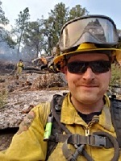

# About Me

  
 
  Hi! My name is Nick and I am a student in the IT-75 course at Sierra College. My college experience this year is just getting started but is very exciting so far. However, it is not new to me. I went to college right out of high school in 2009 and attended Fresno State University for three years and then went to Fresno Community College for a year and a half. While at Fresno State I never really settled on a degree path and ended up dropping out and started going to Fresno City to pursue a Fire Science degree. While at Fresno City I completed two fire science courses and then was accepted in to the fire academy. The fire academy was 8 months long and I loved every minute of it. Being a fire fighter had been my dream for as long as I can remember. After the academy I fell into a rut of working dead-end jobs and firefighting moved to the back burner. In 2018 I was offered a job with Cal Fire, I was finally given an opportunity to achieve my dream of becoming a fire fighter! I was hired on in August and worked with them through December. It was a very busy couple of months, and I was even called out to the Camp Fire in Paradise for two weeks. While working for Cal Fire I realized that being a fire fighter didn't make me as happy as I always thought it would. I decided to take a step back and return to school and finish a degree this time. 
  
 

 * My computer experience so far is more of that of an end user, but I have built 2 different gaming PCs
 * I am taking this class because it is one of the first steps towards an Information Technology degree at Sierra College, but I also want     to learn a little about each aspect of the degree to try and find what really peaks my interest
 * I think the only thing that would prevent me from doing well in this class would be a lack of focus, and maybe a lack of creativity
 * The most important things in my life are my family, girlfriend, and dogs
 * Something interesting about myself... In middle school I was Person of the Week in my hometown newspaper

## Projects

1. [Fundamentals of Programming in Python](https://nwendel16.github.io/Fundamentals-of-Programming-in-Python/)
2. [Internet of Things (Iot)](https://nwendel16.github.io/Internet-of-Things/)
3. [Secure Scripting](https://nwendel16.github.io/Secure-Scripting/)
4. [Data Analytics](https://nwendel16.github.io/Data-Analytics/)
5. [Python Hackathon](https://nwendel16.github.io/Python-Hackathon/)

### Social

 
Follow me on **Twitch**! :trident: [NEPTNE_](https://www.twitch.tv/neptne_) :trident:
